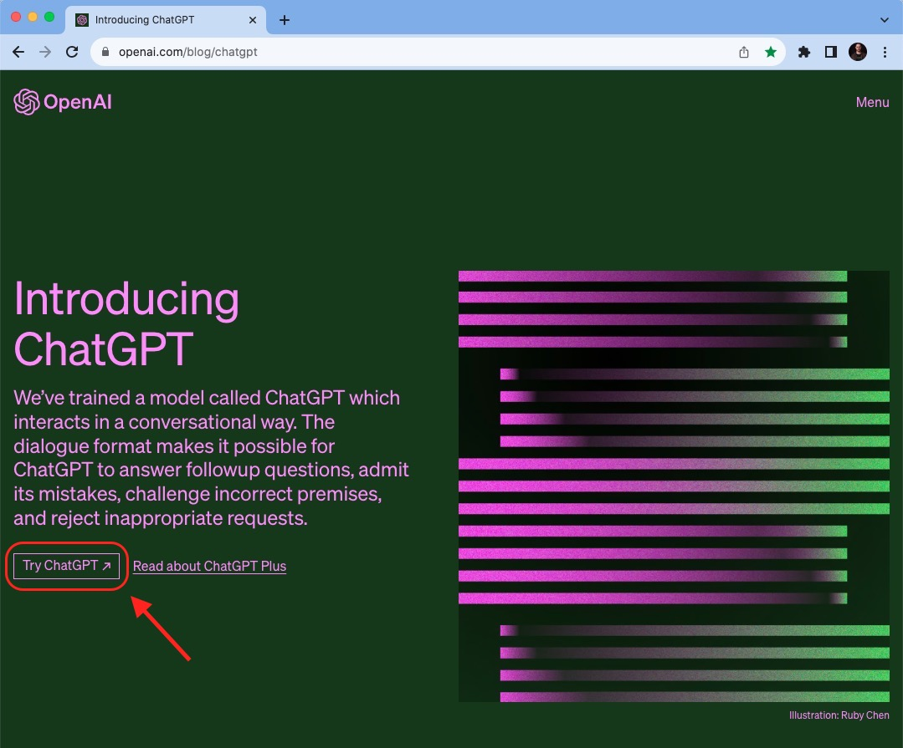

****************************
Como se cadastrar no ChatGPT
****************************

O primeiro passo para se cadastrar é acessar o "site do ChatGPT_"
.. _site do ChatGPT: https://openai.com/blog/chatgpt

Clique em Try ChatGPT 

Caso você já tenha se cadastrado, basta clicar em LOGIN e colocar seu e-mail e senha de cadastro.

Caso você ainda não tenha se cadastrado, basta clicar em SIGN IN.

Agora insira seu e-mail, senha e siga as instruções para verificação de abertura de conta, caso necessário.
