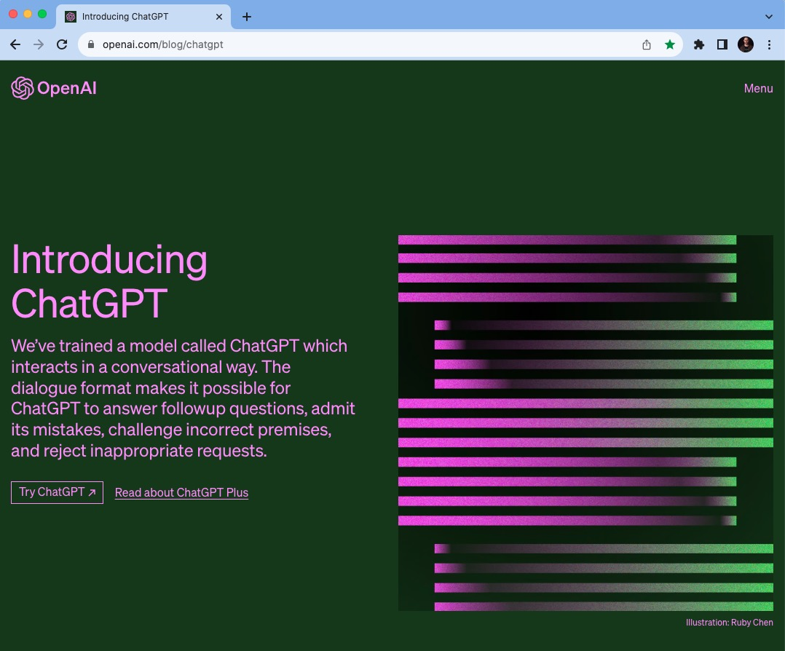
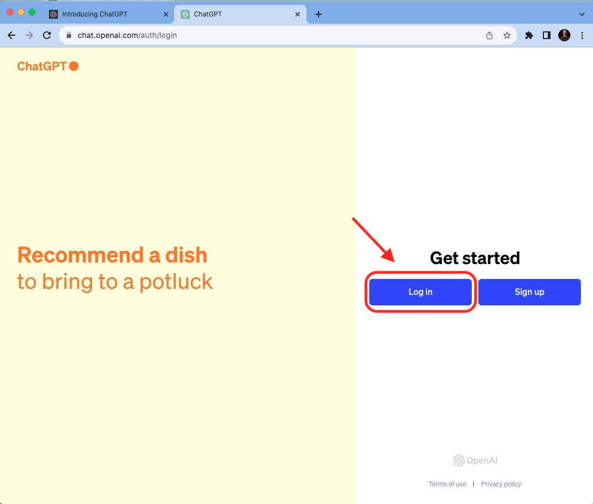
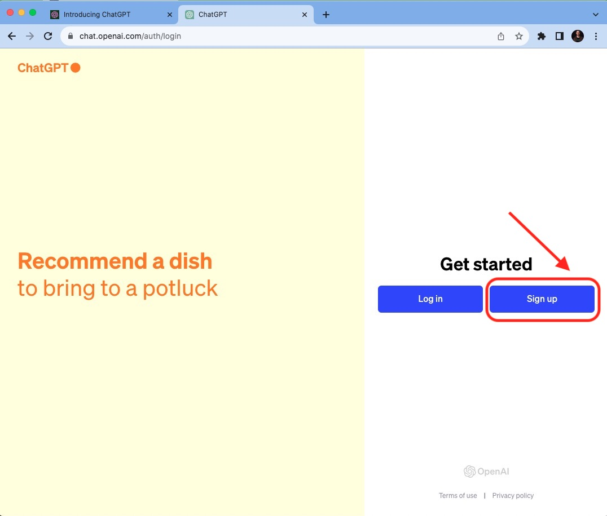
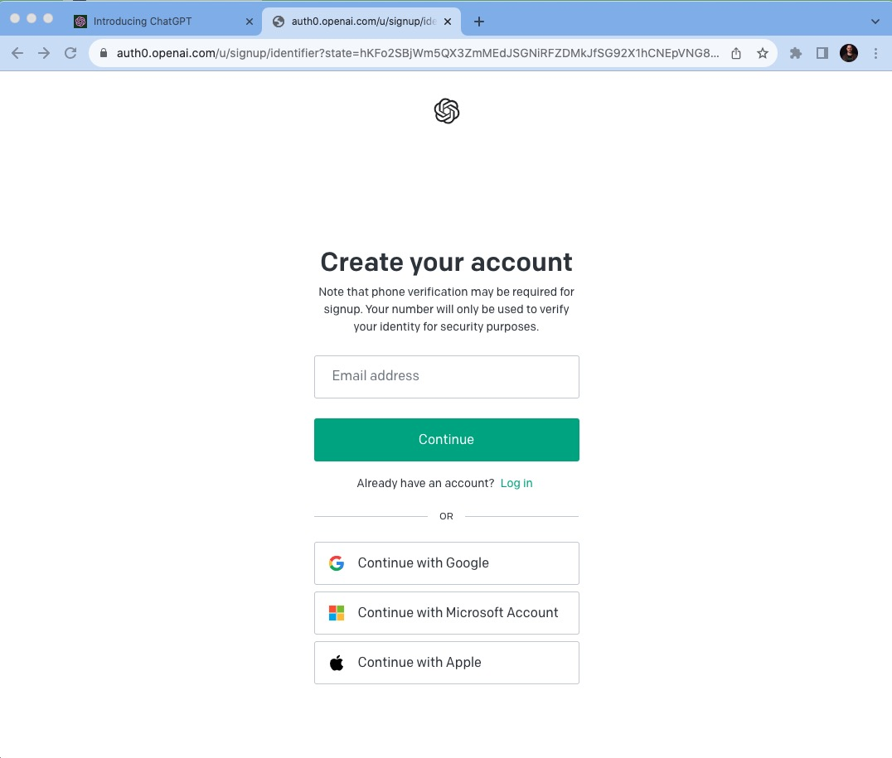

****************************
Como se cadastrar no ChatGPT
****************************

01.Site do ChatGPT
============================

O primeiro passo para se cadastrar é acessar o site do ChatGPT_ 
.. _ChatGPT: https://openai.com/blog/chatgpt

01.a.Entrar no ChatGPT
----------------------

Clique em **Try ChatGPT**.

.. image:: chagpt_try_chatgpt.jpg
   :align: center
   :width: 550

01.b.Logar ou se cadastrar no ChatGPT
-------------------------------------

Caso você já tenha se cadastrado, basta **clicar em LOGIN** e colocar seu e-mail e senha de cadastro.

Caso você ainda não tenha se cadastrado, basta **clicar em SIGN IN** para se cadastrar.

Para se cadastrar, basta você fornecer um e-mail e uma senha ou se cadastrar com sua conta do Google, ou da Microsoft ou da Apple. Agora é só seguir as instruções para verificação de abertura de conta, caso necessário.

