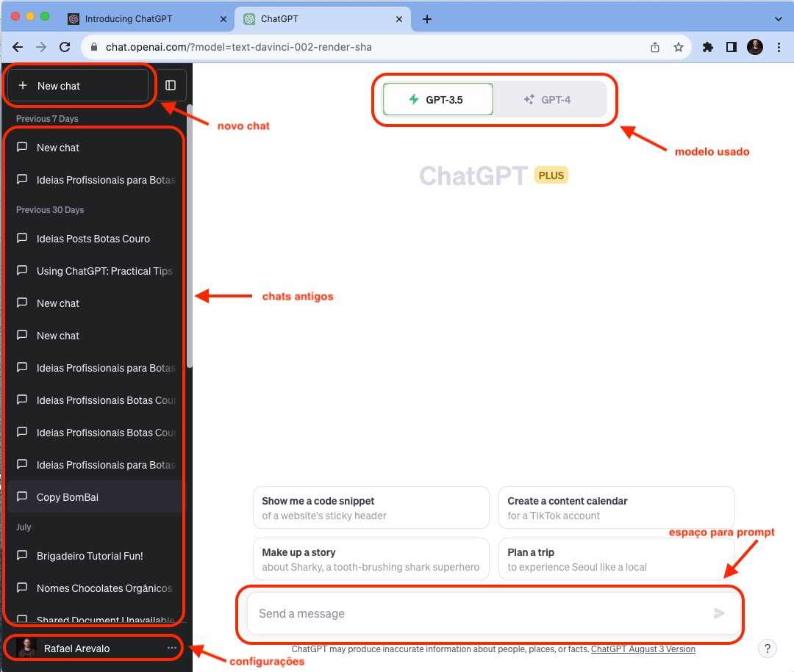

********************
Conhecendo o ChatGPT
********************

01.Mini tour para conhecer o ChatGPT
====================================

Depois de realizar o login, você terá acesso à tela principal do ChatGPT.

.. image:: chatgpt_tela_inicial.jpg
   :align: center
   :width: 550

01.a.Itens básicos da tela principal do ChatGPT.
------------------------------------------------

Descrição de cada campo:

- ``novo chat`` usado para **criar novos chats**.
- ``chats antigos`` usado para ir para **chats antigos**.
- ``modelo usado`` indica a **versão de modelo GPT usado**. Na versão não paga usamos o modelo GPT-3.5 e na versão paga do ChatGPT podemos usar o modelo GPT-4.
- ``espaço para prompt`` este é o **campo para inserir o prompt**.
- ``configurações`` área de **configurações de conta e do ChatGPT**.
