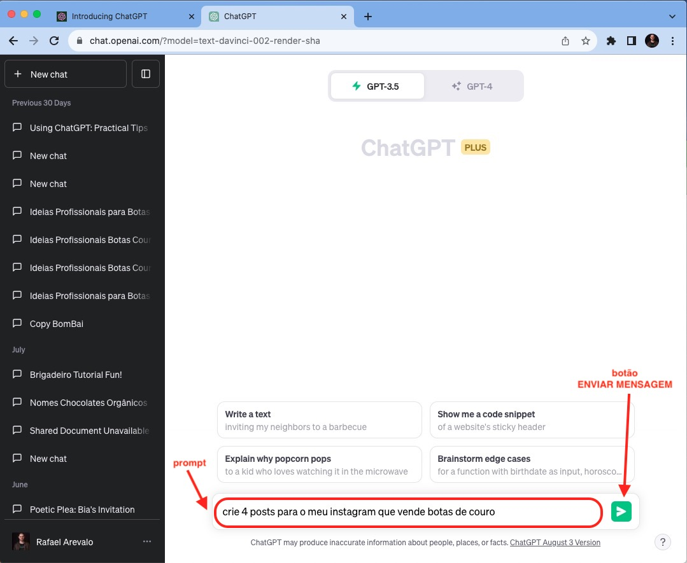
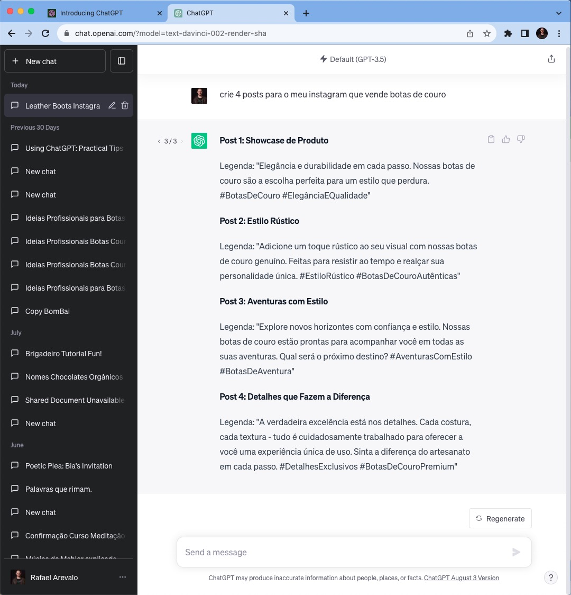
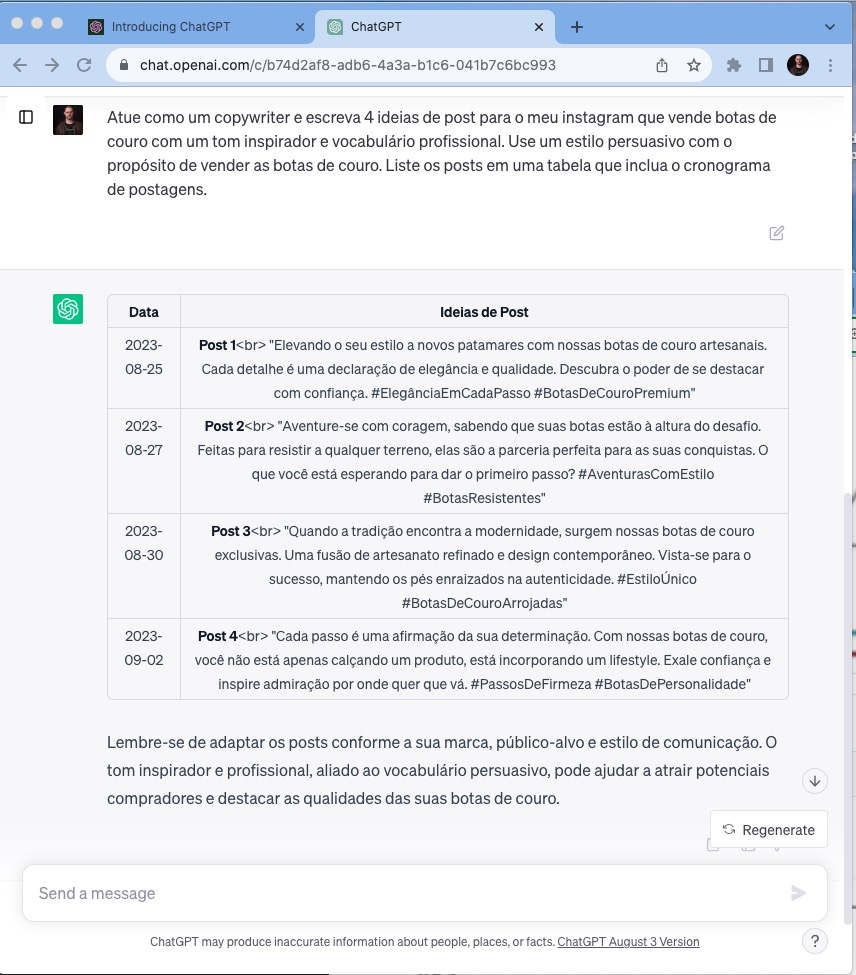

********************
Engenharia de prompt
********************

01.Meu primeiro prompt
======================

**Prompt nada mais é que o comando que damos para o ChatGPT** usando uma linguagem natural, ou seja, como se estivéssemos conversando com um amigo(a) ou colega de trabalho, de forma bem natural mesmo.

Para exemplificar, vamos escrever este prompt: **crie 4 posts para o meu instagram que vende botas de couro**.

Após escrever o prompt, basta clicar no **botão enviar mensagem**.

Agora, veja o resultado gerado a partir do prompt enviado para o ChatGPT.

Repare que de fato o ChatGPT gerou as quatro ideias para post. Mas conseguimos fazer com que o ChatGPT gere respostas melhores a partir de prompts melhores. Esta técnica é chamada de **engenharia de prompt**.

02.Engenharia de prompt
=======================

**Engenharia de prompt é a forma de escrever prompts que gerem as (melhores) respostas esperadas**.

Existem várias formas de engenharia de prompt. Aqui vamos usar uma forma que define para o ChatGPT: 
- O **papel** (ou **função**) que o ChatGPT usa para se comportar de uma determinada maneira.
   - Exemplo -  Atue como um: CEO, gerente de marketing, chef de cozinha, etc.
- A **tarefa** a ser executada pelo ChatGPT.
   - Exemplo -  Faça: um resumo, uma tradução, responda tais perguntas, etc.
- O **tom** de voz usada para transmitir uma emoção.
   - Exemplo - um tom: alegre, calmo, amigável, ousado, respeitoso, etc.
- A **Linguagem (ou vocabulário)** usado no texto gerado.
   - Exemplo - Usar um vocabulário: técnico, publicitário, diplomático, moderno, acadêmico, etc.
- O **estilo** de escrita.
   - Exemplo - Usar um estilo: persuasivo, narrativo, descritivo, etc.
- O **propósito** ao produzir o texto.
   - Exemplo - Faça um texto com o propósito de: persuadir, informar, entreter, ensinar, motivar, evocar emoções e etc.
- O **formato** que a resposta deverá estar.
   - Exemplo - Gere o conteúdo em um formato de: texto curto, lista, tabela, etc.

Voltando para o exemplo anterior em que pedimos para o ChatGPT gerar 4 ideias de posts, mas agora vamos usar a engenharia de prompt para ter um resultado melhor para o nosso objetivo que é gerar 4 ideias de post.

Prompt: 
Atue como um copywriter e escreva 4 ideias de post para o meu instagram que vende botas de couro com um tom inspirador e vocabulário profissional. Use um estilo persuasivo com o propósito de vender as botas de couro. Liste os posts em uma tabela que inclua o cronograma de postagens.

Resumindo os critétios usados na última engenharia de prompt:

- O **papel** (ou **função**) que o ChatGPT usa para se comportar de uma determinada maneira.
   - **Atue como um copywriter e**
- A **tarefa** a ser executada pelo ChatGPT.
   - **escreva 4 ideias de post para o meu instagram que vende botas de couro**
- O **tom** de voz usada para transmitir uma emoção.
   - com um tom **inspirador** e
- A **Linguagem (ou vocabulário)** usado no texto gerado.
   - **vocabulário profissional**
- O **estilo** de escrita.
   - Use um **estilo persuasivo** com o 
- O **propósito** ao produzir o texto.
   - **propósito de vender** as botas de couro
- O **formato** que a resposta deverá estar.
   - **Liste** os posts em uma tabela que inclua o cronograma de postagens.
