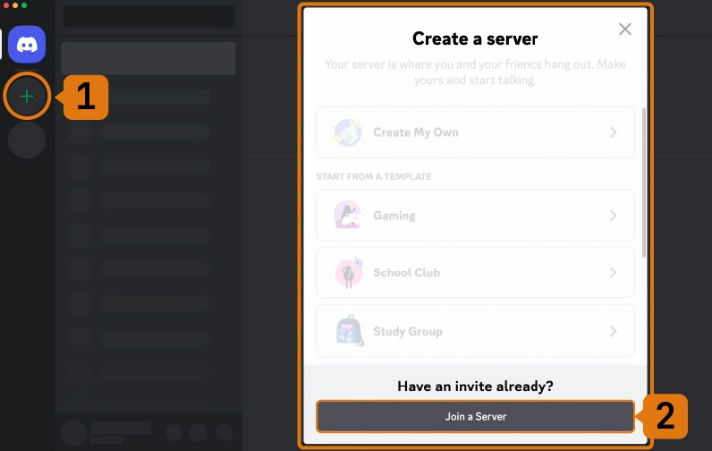

*******************************
Como se cadastrar no Midjourney
*******************************

01. Cadastrar no Discord
========================

02. Cadastrar no Midjourney
===========================

Para começar a gerar imagens com Midjourney, você precisará se inscrever em um plano do Midjourney.

- Visite o site do Midjourney_
.. _Midjourney: https://www.midjourney.com/home/?callbackUrl=%2Fapp%2F

- Se inscreva no Midjourney com a conta do Discord criada anteriormente.

- Escolha um plano no Midjourney que se adeque às suas necessidades. Vale lembrar que o plano gratuito (para teste) dá direito a gerar somente 25 imagens.
Gerar mais de 25 imagens somente com algum plano pago.

03. Entre no servidor do Midjourney no Discord
==============================================

- Abra o Discord e localize a lista de servidores na aba lateral (esquerda)
- Clique no botão **+** no final da lista de servidores do Discord.
- Na janela pop-up que aparecer, clique no botão **join a server**.
- Escreva ou cole o seguinte link_ e aperte o botão **Join**.
.. _Link: https://discord.com/invite/midjourney

1.1 - Subseção do documento
-----------------------------
