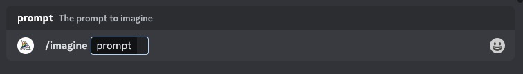
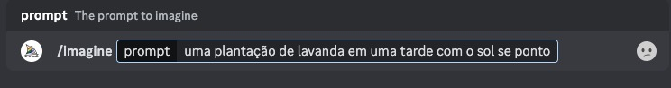
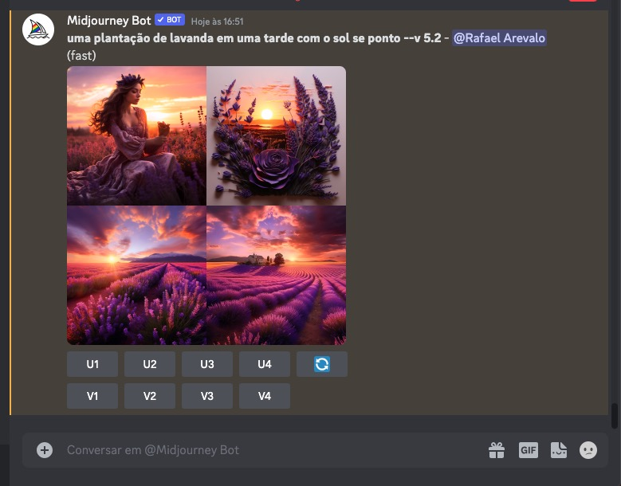

***********************
Conhecendo o Midjourney
***********************

01.Sobre os comandos do Midjourney no Discord
=============================================

Podemos gerar imagens interagindo com um bot do Midjourney dentro do Discord usando um comando.
Comandos são usados para criar imagens, mudar configurações padrões, monitorar as informações do usuário e realizar outras tarefas úteis.

O comando ``/imagine`` gera uma única imagem a partir de um prompt, que é um pequeno texto descritivo com o comando do que queremos que o Midjpourney gere de imagem.

01.a.Como usar o comando ``/imagine``
-------------------------------------

Vá para o campo de texto:

E escreva ``/imagine prompt:`` no campo de texto.

Agora escreva o seu prompt descrevendo a imagem que você gostaria que fosse gerada.
Assim que você enviar o prompt, o bot do Midjourney irá interpretar o prompt e começará a gerar a imagem.

Inserindo o prompt para gerar a imagem desejada.

Aguardando o bot gerar a imagem desejada.

Imagem gerada como resultado final.

