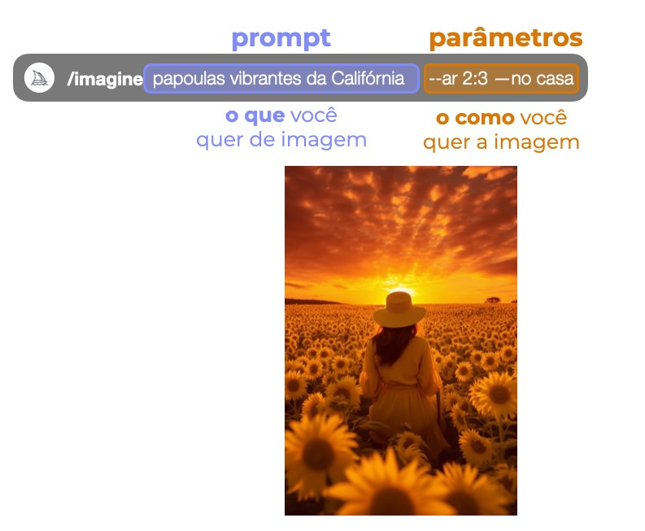
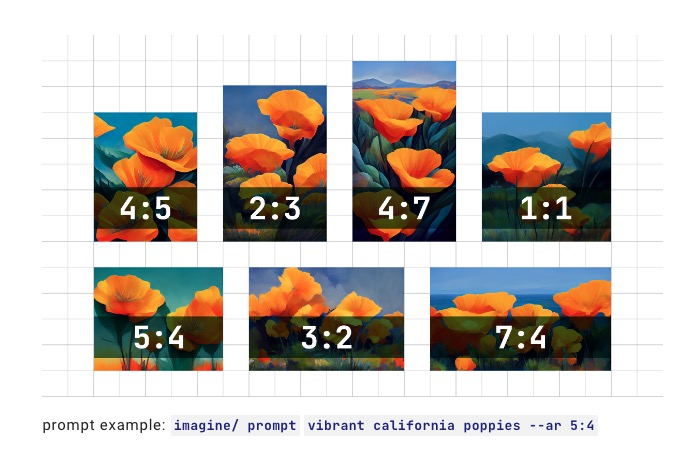

***********
Parâmetros
***********

Parâmetros são opções e que mudaram como a imagem será gerada.

Parâmetros são sempre adicionados ao final de um prompt. É possível que cada prompt tenha vários parâmetros.

Parâmetros básicos
==================

Aspect Ratios (proporções da imagem)
------------------------------------

Altera a proporção entre largura e altura da imagem.
É tipicamente expressado com os dois números (largura:altura) separados por dois pontos.
``2:3``.

Uma imagem quadrada tem a largura igual a altura, então descreve uma proporção de 1:1.
A imagem poderia ser 1500px x 1500px (1'500 pixels de largura e 1'500 pixels de altura) ou 1'000px x 1'000px que a proporção continuará 1:1.

.. topic:: Proporções mais comuns

``--ar 1:1`` Proporção padrão do Midjourney.

``--ar 3:2`` Proporçãom comum para imprimir fotografias.

``--ar 7:2`` Proporção comum para telas de TV e smartphones.

``--ar 2:3`` Proporção para story no Instagram.

``--ar 1:1`` Proporção para feed no Instagram.

